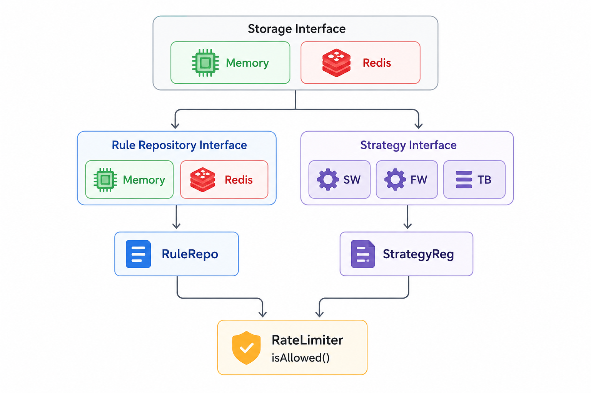

# Rate Limiter

A TypeScript implementation of a pluggable rate limiter built while exploring low-level design concepts and common rate limiting algorithms.

The goal of this project was not just to implement a rate limiter, but to design it in a way that makes it easy to introduce new algorithms and storage backends without modifying the core orchestration logic.



## Overview

The rate limiter follows the Strategy Pattern to support multiple rate limiting algorithms. The `RateLimiter` itself contains no algorithm-specific logic. It is responsible for fetching the applicable rule, selecting the appropriate strategy, and delegating the decision.

This separation allows new algorithms to be introduced by implementing a new strategy without changing existing code.

The current design consists of:

* `RateLimiter` – orchestrates the request flow.
* `RuleRepository` – provides rate limit configurations.
* `StrategyRegistry` – resolves the algorithm implementation.
* `RateLimitStore` – abstracts state storage.
* Strategy implementations such as `FixedWindow`, `SlidingWindow`, and `TokenBucket`.

The storage layer is intentionally abstracted so the same strategies can work with an in-memory store during development and a distributed store such as Redis in production.

## Implemented Algorithms

### Fixed Window

Tracks request count within a fixed time interval.

For example, a rule of `100 requests per minute` creates discrete one-minute windows. Once the limit is reached, further requests are rejected until the next window begins.

This approach is simple and efficient but suffers from the boundary problem where bursts can occur around window transitions.

### Sliding Window Log

Stores request timestamps and evaluates only those that fall within the active window.

Compared to Fixed Window, this produces smoother rate limiting behavior and avoids large bursts at window boundaries. The trade-off is increased memory consumption since individual timestamps must be retained.

## Design Notes

One of the primary goals was extensibility.

Adding a new algorithm should require:

1. Creating a new strategy implementation.
2. Registering it with the strategy registry.

No changes should be required in `RateLimiter`, repositories, or storage implementations.

Similarly, switching from an in-memory store to Redis should not require any changes to the algorithms themselves because they depend only on the `RateLimitStore` contract.

## Concurrency Considerations

The current implementation follows a read-modify-write flow:

```text
get state
   ↓
apply algorithm
   ↓
update state
```

While this works correctly in a single-process environment, it is vulnerable to race conditions under concurrent requests.

For example, two requests may read the same state before either writes its update, causing the configured limit to be exceeded.

Possible solutions include:

* Per-key mutexes for in-memory execution.
* Atomic Redis operations.
* Lua scripts when using Redis in a distributed environment.

Handling concurrency safely becomes especially important when the rate limiter is deployed across multiple application instances.

## Future Improvements

A few ideas that would make the project more production-oriented:

* Redis-backed storage implementation.
* Distributed rate limiting support.
* Token Bucket implementation.
* Sliding Window Counter optimization.
* Per-endpoint and per-IP rules.
* Metrics and observability.
* Middleware integration for Express/Fastify.

## Running the Project

```bash
npm install
npm run dev
```

## Why I Built This

I originally started this project while learning low-level design and wanted to understand how real systems separate concerns between orchestration, configuration, storage, and algorithmic behavior.

Most rate limiter examples online focus on the algorithm itself. This project focuses on the design around the algorithm and how to keep the system extensible as new requirements are introduced.
# rate-limiter
